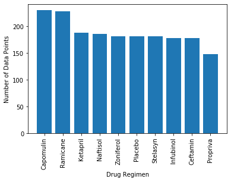
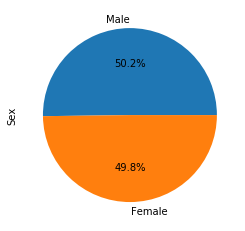
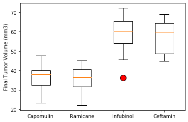
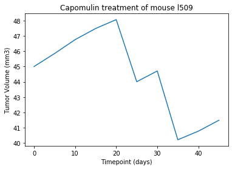
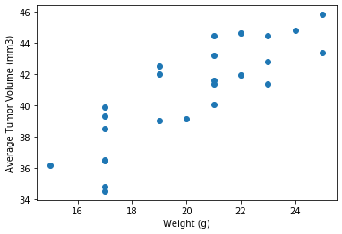

# Drug Trial Analysis

This is an overall analysis (using Python) of a complete data set from a recent animal study involving 250 mice identified with SCC tumor growth were treated through a variety of drug regimens. Over the course of 45 days, tumor development was observed and measured. The purpose of this study was to compare the performance of Pymaceuticals' drug of interest, Capomulin, versus the other treatment regimens. My task was to generate all of the tables and figures needed for the technical report of the study as well as a top-level summary of the study results.

## Analysis Summary

* Generated a summary statistics table consisting of the mean, median, variance, standard deviation, and SEM of the tumor volume for each drug regimen.

* Generated a bar plot using both Pandas's `DataFrame.plot()` and Matplotlib's `pyplot` that shows the number of data points for each treatment regimen.

* Generated a pie plot using both Pandas's `DataFrame.plot()` and Matplotlib's `pyplot` that shows the distribution of female or male mice in the study.

* Calculated the final tumor volume of each mouse across four of the most promising treatment regimens: Capomulin, Ramicane, Infubinol, and Ceftamin. Calculated the quartiles and IQR and quantitatively determined if there were any potential outliers across all four treatment regimens.

* Using Matplotlib, generated a box and whisker plot of the final tumor volume for all four treatment regimens and highlighted any potential outliers in the plot by changing their color and style.

* Generated a line plot of time point versus tumor volume for a single mouse treated with Capomulin.

* Generated a scatter plot of mouse weight versus average tumor volume for the Capomulin treatment regimen.

* Calculated the correlation coefficient and linear regression model between mouse weight and average tumor volume for the Capomulin treatment. Plotted the linear regression model on top of the previous scatter plot.

* Looked across all previously generated figures and tables to write observations or inferences that can be made from the data.

## Final Observations & Insights

* Overall, it is clear that Capomulin is a viable drug regimen to reduce tumor growth.

* Capomulin had the most number of mice complete the study, with the exception of Remicane, all other regimens observed a number of mice deaths across the duration of the study.

* There is a strong correlation between mouse weight and tumor volume, indicating that mouse weight may be contributing to the effectiveness of any drug regimen.

* There was one potential outlier within the Infubinol regimen. While most mice showed tumor volume increase, there was one mouse that had a reduction in tumor growth in the study.
